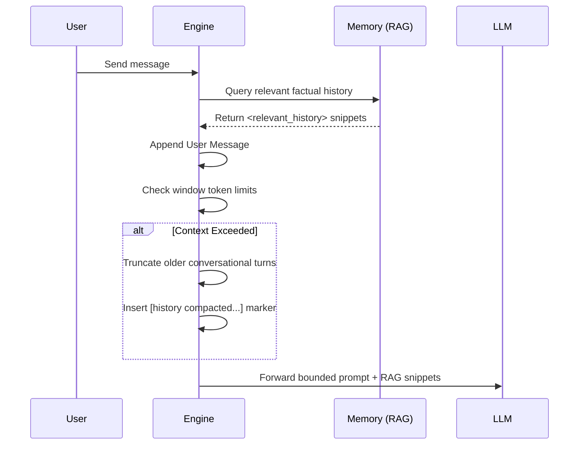

# Tandem Architecture

Tandem is an **engine-owned workflow runtime** for coordinated autonomous work. The repo is organized as a Rust workspace plus thin desktop, web-control, TUI, and npm wrapper clients that all speak the same shared engine concepts.

## 1) Core Engine and Shared Crates

The shared backend is split across crates under `crates/` plus the standalone `engine/` binary crate:

- **tandem-core**: session/state/config/storage, permissions, tool routing, agent registry, engine loop, and shared defaults.
- **tandem-server**: HTTP/SSE API surface, runtime state, workflows, `automation_v2`, routines, pack management, agent teams, capability resolution, browser integration, shared resources, and embedded web UI.
- **tandem-runtime**: shared PTY, LSP, MCP, and workspace-index helpers used by engine-side and client-side flows.
- **tandem-workflows**: workflow spec handling, workflow source tracking, mission builder models, and validation helpers.
- **tandem-agent-teams**: compatibility and path helpers for agent-team manifests.
- **tandem-skills**: skill cataloging, loading, and export helpers for skill manifests and companion workflow metadata.
- **tandem-tools**: tool registry and execution-policy plumbing.
- **tandem-memory**: storage, embeddings, retrieval, governance, and context-layer helpers.
- **tandem-providers**: provider registration plus auth/config integration.
- **tandem-browser**: browser sidecar and browser automation support.
- **tandem-channels**: Discord, Slack, and Telegram integrations.
- **tandem-types**, **tandem-wire**, **tandem-observability**, and **tandem-document**: shared domain models, transport/wire conversion, process logging, and document utilities.

## 2) Headless Engine (`engine/`)

The `engine/` crate is the `tandem-ai` package and the `tandem-engine` binary.

- It composes `tandem-core`, `tandem-server`, `tandem-runtime`, `tandem-tools`, `tandem-providers`, `tandem-memory`, `tandem-browser`, `tandem-types`, `tandem-wire`, and `tandem-observability` into one deployable runtime.
- `serve` starts the HTTP/SSE engine used by desktop, TUI, the control panel, and channel bots.
- `run`, `parallel`, and `tool` provide one-shot, batch, and direct-tool execution paths.
- `browser` and `memory` manage browser sidecars and memory import/inspection.
- Standard installs should use one Tandem state root (`TANDEM_STATE_DIR`) so memory, config, logs, and session storage live together.
- npm launchers are published via `packages/tandem-engine` and `packages/tandem-ai`.

## 3) Desktop Application (Tauri + React/Vite)

The desktop application wraps the shared engine and exposes local filesystem, approval, and orchestration UX.

- **Frontend (`src/`)**:
  - React + Vite UI for chat, file browsing, tool staging, agent catalog browsing, and orchestration views.
  - Uses `src/lib/tauri.ts` to interface with the backend via IPC.
- **Backend (`src-tauri/src/`)**:
  - A Tauri v2 shell over the shared Tandem crates.
  - Manages encrypted API keys, keystore/vault state, filesystem operations, and GUI-specific approval flows.

## 4) Control Panel (`packages/tandem-control-panel`)

The control panel is the browser-based operations surface for workflows, teams, packs, channels, memory, and catalog browsing.

- It talks to the same engine HTTP/SSE API as the desktop client.
- It focuses on workflow studio, orchestrator/runs, agent teams, coding workflows, automation authoring, and shared catalogs.
- Generated catalog data and shared selectors keep the control panel aligned with desktop behavior where the surfaces overlap.

## 5) Terminal User Interface (`crates/tandem-tui`)

The TUI provides a native terminal experience for developers who want to stay close to their code.

- **Stack**: built with `ratatui` and Crossterm.
- **Features**: markdown rendering, session persistence, command-driven workflow, and real-time engine interaction.
- **Integration**: initializes `tandem-core` directly inside the terminal process, with shared runtime helpers where needed, so it can run with or without a separate local HTTP server.

## 6) Runtime Data Flow

1. **User Interaction**:
   - **Desktop**: React UI -> Tauri IPC -> shared Tandem backend or engine service.
   - **Control panel**: browser UI -> HTTP/SSE API on the engine.
   - **TUI**: terminal UI -> in-process core/runtime.
   - **Channels**: Discord/Slack/Telegram adapters -> `tandem-server` and `tandem-channels` flows.
2. **Tool Execution**:
   - LLMs propose tool calls and workflow steps.
   - Desktop and other GUI clients gate risky operations through approval flows.
   - Headless and TUI contexts use the configured autonomy and permission policies.
   - Multi-agent coordination happens through the engine's workflow, run, and worktree/runtime state instead of client-local state.

## 7) Security and Trust Boundaries

- Local-first design: API keys, SQLite databases, and project settings are stored securely on the user's filesystem.
- Operations that mutate the host machine (writing files, running terminal commands) are gated by policies and visual approvals in the Desktop app.
- Multi-agent orchestrators respect token budgets to prevent runaway LLM costs.

## 8) Context & Memory Management

Tandem is intentionally designed to avoid "context snowballing" or endless token accumulation bugs - an issue commonly seen when relying on recursive inline summarization loops.

Tandem uses a **strict sliding window** mechanism within its interaction loops (`compact_chat_history`). When a session approaches the context limitations of its designated model:

1. It truncates older conversational turns.
2. It substitutes them cleanly with static markers indicating omitted history rather than endlessly attempting to re-inject rules or summarize prior context strings.

To ensure agents do not lose critical facts during long-running sessions, historical insights and project context are offloaded to semantic-memory retrieval (RAG) rather than statically prepending huge workspace definitions. Relevant facts are fetched just in time from the `Memory` subsystem and injected cleanly into prompts (via `<relevant_history>` tags).
