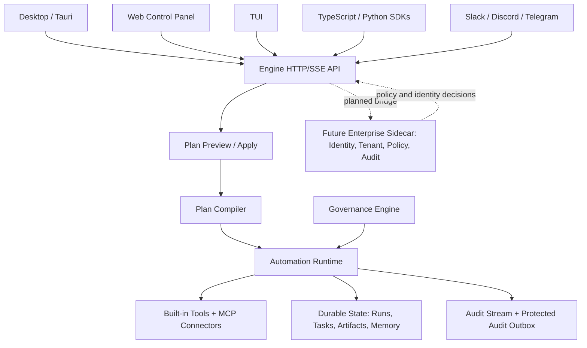

# Tandem AI Runtime Infrastructure

Tandem is governed AI runtime infrastructure for long-running agentic work.

Most agent products treat a conversation as the runtime. That is convenient for demos, but weak for enterprise work: transcripts do not provide durable execution state, tenant boundaries, replay, scoped tools, approval receipts, or policy hooks by themselves.

Tandem puts those concerns in the engine. Chat, desktop, web, channels, and SDKs are entrypoints; the runtime remains the source of truth.

## Infrastructure Model

Tandem centers on a small set of runtime primitives:

- **Engine-owned state:** Runs, tasks, blackboards, checkpoints, artifacts, validations, approvals, receipts, and replayable events live in durable engine state.
- **Canonical run journal:** Every meaningful run has a durable identity that can be inspected, resumed, retried, and debugged.
- **Execution graph:** Workflows and automations compile into task graphs with dependencies, gates, outputs, validation, and ownership.
- **Tool and MCP policy:** Built-in tools and MCP connector access can be scoped to the workflow or step that needs them.
- **Approval gates:** Consequential actions can pause for human approval, rework, or cancellation through runtime-owned approval records.
- **Artifact contracts:** Outputs are represented as artifacts with validation outcomes rather than prose-only success claims.
- **Receipts and audit:** External actions, approvals, denials, provider changes, and tool ledger events can be recorded as durable audit events.
- **Replay and recovery:** Checkpoints, run history, validation records, and repair paths make failures operationally visible.

## Platform Architecture

The important boundary is that clients do not become separate runtimes. They submit, observe, and approve work through the same engine-owned model.

## What Platform Teams Get

- A runtime for long-running AI work rather than a model prompt loop.
- A place to enforce tool access, connector access, approvals, and policy.
- Inspectable run and artifact state for debugging and compliance workflows.
- Provider neutrality across OpenRouter, Anthropic, OpenAI, OpenCode Zen, Ollama, and compatible endpoints.
- A self-hostable engine path with a public/private enterprise split designed around a sidecar contract, not a closed engine fork.

## Domain Proof: Fintech Operations

Fintech compliance and risk operations are a strong example of why Tandem is runtime infrastructure instead of a chat wrapper. A compliance/risk update brief can run as a durable workflow with scoped sources, cited artifacts, validation metadata, protected approval gates, and replayable audit evidence.

The boundary matters: Tandem can help investigate, draft, reconcile, classify, and prepare evidence. It should not autonomously move money, freeze accounts, approve customers, file regulatory reports, make credit decisions, or change risk ratings. Those actions require runtime-verified protected approvals, policy evidence, and stronger enterprise gates; approval-gate workflow state alone should not be described as complete authorization.

## What Tandem Is Not

- **Not a chatbot.** Conversation is an interface; the runtime is the source of truth.
- **Not a Zapier clone.** Tandem steps can perform judgment-shaped work, validate outputs, and pause at governed gates.
- **Not only a workflow SaaS.** The reusable product surface is the runtime model: runs, scopes, artifacts, approvals, audit, and replay.
- **Not a model router.** Provider routing is useful, but the company is the execution layer around the model.
- **Not consulting wrapped in prompts.** Productized workflows should compile into reusable runtime-owned bundles and governance records.

## Related Docs

- [Enterprise readiness](ENTERPRISE_READINESS.md)
- [Enterprise proof walkthrough](ENTERPRISE_PROOF_WALKTHROUGH.md)
- [Workflow runtime](WORKFLOW_RUNTIME.md)
- [MCP improvements](MCP_IMPROVEMENTS.md)
