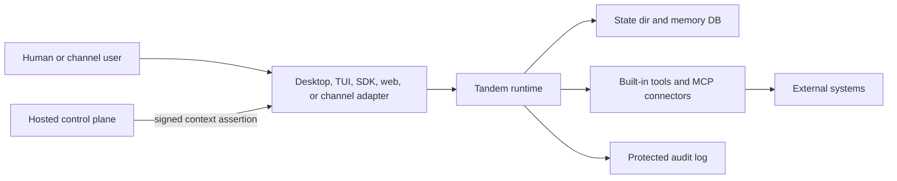

# Runtime Trust Boundaries

Tandem treats the model as an untrusted requester. The runtime owns authority:
tenant context, tool visibility, memory access, approvals, provider and MCP
secrets, persisted state, and protected audit evidence.

## Deployment Modes

| Mode                   | Tenant source                                                                           | Transport trust                                  | Runtime behavior                                                                                                                                |
| ---------------------- | --------------------------------------------------------------------------------------- | ------------------------------------------------ | ----------------------------------------------------------------------------------------------------------------------------------------------- |
| `local_single_tenant`  | Local implicit tenant. Test builds can still exercise explicit headers.                 | Optional local API token when configured.        | Suitable for desktop and local engine use. Raw hosted tenant headers are ignored in production local mode.                                      |
| `hosted_single_tenant` | Signed context assertion from the hosted control plane.                                 | API token plus assertion-bearing client request. | Raw tenant headers are rejected. Assertion signature, issuer, audience, expiry, actor, deployment, key metadata, and replay policy must verify. |
| `enterprise_required`  | Signed context assertion from the enterprise control plane or private sidecar boundary. | API token plus assertion-bearing client request. | Same fail-closed assertion enforcement as hosted mode, intended for stricter customer-controlled deployment boundaries.                         |

Memory follows the same split. Local desktop and local engine installs may use
the local-global memory partition because the process is a trusted single-user
runtime. Hosted, enterprise, verifier-key-configured, or hosted-control-plane
configured runtimes activate strict memory/context policy before serving
prompts: provider context uses tenant-scoped memory, missing verified context
blocks governed injection, and local-global fallback is treated as a local-only
behavior. `/global/health` and `/enterprise/readiness` expose the effective
auth mode, verifier/signing-key configuration status, strict enforcement
status, and memory policy mode without exposing key material.

## Boundary Responsibilities

| Boundary                 | Runtime trusts                                                                         | Operator must protect                                                                |
| ------------------------ | -------------------------------------------------------------------------------------- | ------------------------------------------------------------------------------------ |
| Client to runtime        | Transport token and, in hosted modes, a signed context assertion.                      | API tokens, TLS termination, channel webhook secrets, and assertion delivery.        |
| Control plane to runtime | Ed25519 public keys configured in `TANDEM_CONTEXT_ASSERTION_PUBLIC_KEYS` or file form. | Assertion private keys, key rotation, issuer/audience configuration, and clock sync. |
| Runtime to state dir     | Files and SQLite databases under the configured state directory.                       | Filesystem permissions, backups, retention, and host access.                         |
| Runtime to providers/MCP | Runtime-owned provider credentials and tenant-scoped MCP secret refs.                  | Secret provisioning, tenant binding, and connector allowlists.                       |
| Runtime to audit readers | Protected audit envelopes filtered by tenant context.                                  | Audit retention, export access, and downstream SIEM or evidence handling.            |

## Assertion Denial Evidence

Hosted and enterprise modes fail closed when tenant context cannot be verified.
The runtime writes protected audit events when possible:

- `context_assertion.rejected` for missing, malformed, untrusted, expired, or
  replayed assertions.
- `tenant_context.ingress.denied` when a hosted request tries to use raw
  tenant headers instead of a signed assertion.
- `tenant_context.authorization.denied` when the authenticated principal and
  resolved tenant context disagree after ingress.

Untrusted assertion claims are not used as tenant-scoped evidence. Rejections
that cannot be safely attributed are written under the local implicit audit
scope so operators still have evidence without granting a forged tenant view.

## Hosted vs Self-Hosted Operation

In Tandem Hosted, the hosted control plane owns assertion issuance and key
rotation. The runtime should only receive public verification keys and short
lived assertions for concrete users, workspaces, deployments, and resource
scopes.

In self-hosted or enterprise deployments, the customer-controlled boundary may
own the control plane, private sidecar, or both. The same invariant applies:
private signing keys stay outside the runtime, assertions are short lived, and
raw tenant headers are not accepted in hosted/enterprise modes.

Local desktop remains intentionally simpler: the local engine is trusted as the
single-user runtime for that machine, and stronger hosted tenant assertions are
not required unless the deployment mode is changed.

## Automation Webhook Raw Events

Automation webhook intake persists a tenant-scoped raw inbox record after
signature verification and before delivery routing. The raw request body is
stored by payload pointer under the runtime data directory; the inbox record
keeps the body digest, header digest, redacted header preview, trigger/provider
scope, retention deadline, delivery ID, and queued run ID when routing produces
one. Sensitive header names such as authorization, cookie, token, secret, and
signature are redacted in the persisted preview.

## Threat Table

| Threat                               | Current mitigation                                                                                                                                                                                   | Remaining gap                                                                                                         |
| ------------------------------------ | ---------------------------------------------------------------------------------------------------------------------------------------------------------------------------------------------------- | --------------------------------------------------------------------------------------------------------------------- |
| Forged context assertion             | Hosted and enterprise modes verify Ed25519 signatures, issuer, audience, key status, key purpose, tenant/deployment constraints, and resource scope prefixes before accepting tenant context.        | Audit coverage should continue to expand for every denial class; see TAN-195.                                         |
| Replayed context assertion           | Replay mode defaults to `bound`, rejecting assertion-id substitution and allowing identical assertion reuse only until expiry. `one_shot` is available when issuers can mint per-request assertions. | Multi-replica deployments need shared replay state or sticky routing; see `docs/CONTEXT_ASSERTION_SECURITY.md`.       |
| Stolen transport token               | Hosted/enterprise requests still need a signed tenant assertion in addition to the transport token. Local mode ignores raw hosted tenant headers.                                                    | Rotate transport tokens and keep TLS termination inside the trusted boundary.                                         |
| Malicious or confused MCP server     | Runtime-owned MCP secret refs validate tenant context before resolution, and env-backed MCP secrets are local-only.                                                                                  | MCP tenant-scope denials should emit protected audit evidence from the server boundary; see TAN-195.                  |
| Compromised channel webhook          | Channel adapters verify provider-specific webhook signatures before injecting channel sessions and may attach signed context assertions for hosted runtime calls.                                    | Real-workspace channel approval E2E remains a validation track; see TAN-74.                                           |
| Misconfigured assertion key rotation | Key metadata supports `kid`, purpose, status, lifetime, audience, organization, deployment, and resource-scope restrictions, and startup logs summarize configured keys without public key material. | Operators must keep the runtime keyset and issuer rotation windows aligned; see `docs/CONTEXT_ASSERTION_SECURITY.md`. |
