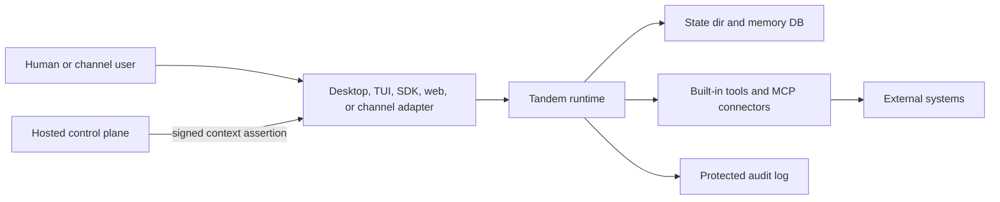

# Runtime Trust Boundaries

Tandem treats the model as an untrusted requester. The runtime owns authority:
tenant context, tool visibility, memory access, approvals, provider and MCP
secrets, persisted state, and protected audit evidence.

## Deployment Modes

| Mode | Tenant source | Transport trust | Runtime behavior |
| --- | --- | --- | --- |
| `local_single_tenant` | Local implicit tenant. Test builds can still exercise explicit headers. | Optional local API token when configured. | Suitable for desktop and local engine use. Raw hosted tenant headers are ignored in production local mode. |
| `hosted_single_tenant` | Signed context assertion from the hosted control plane. | API token plus assertion-bearing client request. | Raw tenant headers are rejected. Assertion signature, issuer, audience, expiry, actor, deployment, key metadata, and replay policy must verify. |
| `enterprise_required` | Signed context assertion from the enterprise control plane or private sidecar boundary. | API token plus assertion-bearing client request. | Same fail-closed assertion enforcement as hosted mode, intended for stricter customer-controlled deployment boundaries. |

## Boundary Responsibilities

| Boundary | Runtime trusts | Operator must protect |
| --- | --- | --- |
| Client to runtime | Transport token and, in hosted modes, a signed context assertion. | API tokens, TLS termination, channel webhook secrets, and assertion delivery. |
| Control plane to runtime | Ed25519 public keys configured in `TANDEM_CONTEXT_ASSERTION_PUBLIC_KEYS` or file form. | Assertion private keys, key rotation, issuer/audience configuration, and clock sync. |
| Runtime to state dir | Files and SQLite databases under the configured state directory. | Filesystem permissions, backups, retention, and host access. |
| Runtime to providers/MCP | Runtime-owned provider credentials and tenant-scoped MCP secret refs. | Secret provisioning, tenant binding, and connector allowlists. |
| Runtime to audit readers | Protected audit envelopes filtered by tenant context. | Audit retention, export access, and downstream SIEM or evidence handling. |

## Assertion Denial Evidence

Hosted and enterprise modes fail closed when tenant context cannot be verified.
The runtime writes protected audit events when possible:

- `context_assertion.rejected` for missing, malformed, untrusted, expired, or
  replayed assertions.
- `tenant_context.ingress.denied` when a hosted request tries to use raw
  tenant headers instead of a signed assertion.
- `tenant_context.authorization.denied` when the authenticated principal and
  resolved tenant context disagree after ingress.

Untrusted assertion claims are not used as tenant-scoped evidence. Rejections
that cannot be safely attributed are written under the local implicit audit
scope so operators still have evidence without granting a forged tenant view.

## Hosted vs Self-Hosted Operation

In Tandem Hosted, the hosted control plane owns assertion issuance and key
rotation. The runtime should only receive public verification keys and short
lived assertions for concrete users, workspaces, deployments, and resource
scopes.

In self-hosted or enterprise deployments, the customer-controlled boundary may
own the control plane, private sidecar, or both. The same invariant applies:
private signing keys stay outside the runtime, assertions are short lived, and
raw tenant headers are not accepted in hosted/enterprise modes.

Local desktop remains intentionally simpler: the local engine is trusted as the
single-user runtime for that machine, and stronger hosted tenant assertions are
not required unless the deployment mode is changed.
