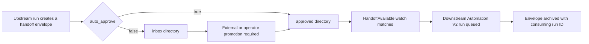

Connected-agent handoffs are Tandem's current file-backed bridge between two Automation V2 workflows. An upstream workflow deposits a typed handoff envelope; a downstream workflow watches its approved directory and starts a new run when a matching handoff is available.

This is a compatibility feature for simple, sequential workflow-to-workflow handoffs. It is not yet the versioned, durable orchestration graph described in [Building Stateful Workflows in Tandem](./stateful-workflows/): it has no public goal record, named transition graph, loop policy, correlated wait node, or transactional cross-workflow lineage.

## Current lifecycle



The scheduler evaluates active automations with watch conditions. It skips an automation that already has a queued or running run, and it starts at most one matching run per evaluation.

## Supported fields

| Field              | Current behavior                                                                                        |
| ------------------ | ------------------------------------------------------------------------------------------------------- |
| `handoff_config`   | Selects the inbox, approved, and archived directories and whether deposits bypass the inbox.            |
| `watch_conditions` | Supports only `kind: "handoff_available"`, optionally filtered by source automation and artifact type.  |
| `scope_policy`     | Restricts the relative workspace paths agents may read and write and the paths the scheduler may watch. |

All three fields are optional. Omitting `watch_conditions` means handoffs do not start the automation.

## Configure the handoff directories

```json
{
  "handoff_config": {
    "inbox_dir": "shared/handoffs/inbox",
    "approved_dir": "shared/handoffs/approved",
    "archived_dir": "shared/handoffs/archived",
    "auto_approve": true
  }
}
```

Paths are relative to the automation workspace root.

| Field          | Default                    | Meaning                                                                              |
| -------------- | -------------------------- | ------------------------------------------------------------------------------------ |
| `inbox_dir`    | `shared/handoffs/inbox`    | Staging directory when automatic approval is disabled.                               |
| `approved_dir` | `shared/handoffs/approved` | Directory scanned by the downstream watch evaluator.                                 |
| `archived_dir` | `shared/handoffs/archived` | Destination for a consumed envelope.                                                 |
| `auto_approve` | `true`                     | Writes directly to the approved directory when true; writes to the inbox when false. |

`auto_approve: false` does **not** create an Automation V2 approval gate and Tandem does not currently expose a public handoff-promotion API. Something outside this file-handoff path must review and move the envelope from the inbox to the approved directory. Use an Automation V2 approval node when approval must be governed inside a run.

## Watch for a matching handoff

The only implemented watch condition is `handoff_available`:

```json
{
  "watch_conditions": [
    {
      "kind": "handoff_available",
      "source_automation_id": "opportunity-scout",
      "artifact_type": "shortlist"
    }
  ]
}
```

Both filters are optional. With neither filter, the condition accepts any approved envelope whose `target_automation_id` is the watching automation.

Conditions such as `any_file_present`, `modified_since_last_run`, `empty`, `file_exists`, `flag_set`, and `upstream_completed` are not implemented and must not be sent to the Automation V2 API.

The watch starts a new Automation V2 run at its eligible root nodes. It does not invoke a node by ID and it does not resume an existing run.

## Handoff envelope

An approved handoff is a JSON file named from its `handoff_id`. Its current shape is:

```json
{
  "handoff_id": "hoff-20260710-01",
  "source_automation_id": "opportunity-scout",
  "source_run_id": "automation-v2-run-source",
  "source_node_id": "rank_opportunities",
  "target_automation_id": "proposal-writer",
  "artifact_type": "shortlist",
  "created_at_ms": 1783641600000,
  "content_path": "job-search/shortlists/2026-07-10.md",
  "content_digest": "sha256-hex-digest",
  "metadata": {
    "summary": "Three reviewed opportunities"
  }
}
```

`content_path` is a relative pointer to the real artifact. Treat the envelope and the referenced content as untrusted input. Validate the artifact type, path, digest, and content before using them in an external mutation.

When consumed, the archived envelope gains `consumed_by_run_id`, `consumed_by_automation_id`, and `consumed_at_ms`.

## Restrict filesystem access

```json
{
  "scope_policy": {
    "readable_paths": ["shared/handoffs/", "job-search/shortlists/"],
    "writable_paths": ["job-search/proposals/"],
    "denied_paths": [".env", ".tandem/secrets/"],
    "watch_paths": ["shared/handoffs/approved/"]
  }
}
```

| Field            | Behavior                                                                             |
| ---------------- | ------------------------------------------------------------------------------------ |
| `readable_paths` | Agents may read these prefixes. An empty list inherits unrestricted workspace reads. |
| `writable_paths` | Agents may write these prefixes; writable paths are also readable.                   |
| `denied_paths`   | Always wins over readable and writable prefixes.                                     |
| `watch_paths`    | Restricts scheduler scans. When empty, it falls back to `readable_paths`.            |

Path matching is relative to the workspace root and uses whole-prefix semantics.

## Complete downstream configuration

This example configures a downstream workflow to accept only `shortlist` artifacts from `opportunity-scout`:

```bash
curl -sS -X PATCH http://127.0.0.1:39731/automations/v2/proposal-writer \
  -H "content-type: application/json" \
  -d '{
    "handoff_config": {
      "inbox_dir": "shared/handoffs/inbox",
      "approved_dir": "shared/handoffs/approved",
      "archived_dir": "shared/handoffs/archived",
      "auto_approve": true
    },
    "watch_conditions": [
      {
        "kind": "handoff_available",
        "source_automation_id": "opportunity-scout",
        "artifact_type": "shortlist"
      }
    ],
    "scope_policy": {
      "readable_paths": ["shared/handoffs/", "job-search/shortlists/"],
      "writable_paths": ["job-search/proposals/"],
      "denied_paths": [".env", ".tandem/secrets/"],
      "watch_paths": ["shared/handoffs/approved/"]
    }
  }'
```

Creating an envelope is currently an engine/internal integration operation, not a public HTTP, SDK, or MCP method. If your client writes an envelope directly, it must use the exact current schema, validate the workspace-relative path, write atomically, and preserve a stable `handoff_id` for retries.

## Control Panel

Open **Automations**, edit the downstream workflow, and expand **Connected agents**. The editor exposes:

- handoff directory configuration and the `auto_approve` switch;
- `HandoffAvailable` source and artifact-type filters;
- readable, writable, denied, and watch path prefixes;
- the current inbox, approved, and archived handoff lists when the server supports handoff inspection.

This screen configures one workflow's file handoffs. It is not a visual multi-workflow composer and it does not display a durable long-running goal across several runs.

## Reliability limits

The current bridge uses workspace files and in-memory scheduler evaluation. Keep these limitations in mind:

- handoff consumption and downstream-run creation are not one database transaction in the legacy path;
- the filesystem envelope is the compatibility record, not a durable orchestration event stream;
- there is no public loop bound, goal deadline, cross-workflow budget, compensation plan, or terminal outcome;
- changing the downstream workflow does not pin an existing goal to a published definition snapshot;
- a terminal downstream run does not automatically choose another workflow unless another approved handoff is produced.

For state inside one Automation V2 run—including checkpoints, waits, approvals, events, snapshots, and recovery—use [Building Stateful Workflows in Tandem](./stateful-workflows/). Versioned multi-workflow goals, named transition loops, correlated waits, and transactional lineage require the orchestration runtime and authoring surfaces rather than this compatibility bridge.

## See also

- [Building Stateful Workflows in Tandem](./stateful-workflows/)
- [Automation V2 Webhooks](./automation-v2-webhooks/)
- [MCP Automated Agents](./mcp-automated-agents/)
- [Control Panel](./control-panel/)
