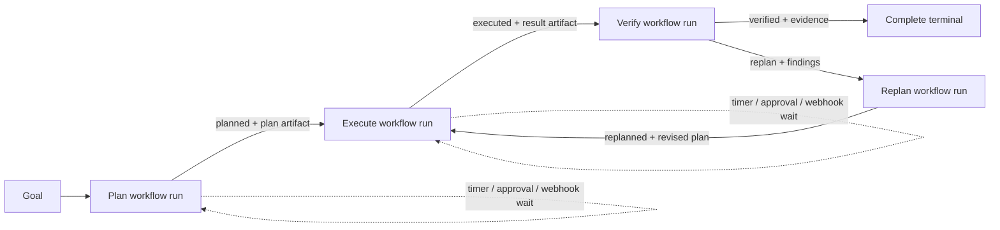

Use a long-running goal when one durable objective must move through several
Automation V2 workflows, preserve lineage and artifacts between them, wait for
external decisions, and loop through verification and replanning without
turning the whole operation into one oversized run.

Agent search terms: long-running goal, multi-workflow orchestration, goal
projection, workflow handoff, orchestration version, goal replay, replan loop,
goal action, goal budget, cross-run artifact.

## Choose the correct boundary

| Need | Released runtime boundary |
| --- | --- |
| Parallel or dependent steps that share one checkpoint | One Automation V2 run |
| Timer, approval, webhook, or external-condition pause inside a workflow | A typed Automation V2 wait; wake and continue the **same run** |
| Move from Plan to Execute, Execute to Verify, or Replan back to Execute | A named orchestration transition; commit a handoff and create a **new downstream run** |
| Finish at a terminal orchestration node | Settle completion; no downstream run is created |
| Inspect current and historical operator state | Read the canonical goal projection in `live` or `replay` mode |

An orchestration does not merge workflow checkpoints. Each workflow run keeps
its own frozen definition snapshot, outputs, retries, waits, and recovery state.
The goal supplies durable lineage across those runs.



The dotted paths are same-run waits. The solid workflow-to-workflow paths are
new-run transitions linked by `GoalRunLink.parent_run_id` and
`triggering_handoff_id`.

## Lifecycle and versions

1. Create or update Automation V2 definitions for Plan, Execute, Verify, and
   Replan.
2. Create orchestration draft `version = 0`. Drafts may be incomplete while
   edited.
3. Refresh workflow references to pin each workflow node to its current
   same-tenant definition hash.
4. Validate graph structure, artifact contracts, tenant scope, and workflow
   reference freshness.
5. Publish the next immutable orchestration version.
6. Start a goal from that version, or omit the version to select the latest
   published version at start time.
7. Operate the goal through waits, named transitions, approvals, completion,
   projection actions, and recovery.

A running goal remains pinned to its stored `orchestration_version` and to the
workflow hashes captured at publication. Editing draft v0 or publishing a newer
version does not migrate an active goal. Start a new goal to adopt the new
version.


Open a library entry to author its graph, inspect workflow and wait nodes,
validate references, preview transitions, publish an immutable version, and
start a goal.


Draft updates use `expected_updated_at_ms` as an optimistic concurrency token.
Published versions are immutable. Use `listVersions()` and `getVersion()` for
release history, and `staleReferences()` before publishing after any referenced
workflow changes.

## Complete TypeScript example

This example assumes four Automation V2 definitions already exist with IDs
`goal-plan`, `goal-execute`, `goal-verify`, and `goal-replan`. Their internal DAGs
may contain typed waits; orchestration transitions happen only after the active
workflow is ready to hand off or settle.

```ts
import { TandemClient } from "@frumu/tandem-client";

const client = new TandemClient({
  baseUrl: process.env.TANDEM_ENGINE_URL ?? "http://127.0.0.1:39731",
  token: process.env.TANDEM_ENGINE_TOKEN!,
});

const orchestrationId = "delivery-loop";

const created = await client.orchestrations.create({
  orchestration_id: orchestrationId,
  name: "Goal -> Plan -> Execute -> Verify -> Replan",
  description: "Deliver verified work, replanning until verification passes.",
  root_node_id: "plan",
  nodes: [
    {
      node_id: "plan",
      name: "Plan",
      position: { x: 0, y: 0 },
      kind: "workflow",
      automation_id: "goal-plan",
      allowed_transition_keys: ["planned"],
      emits_artifact_types: ["execution-plan"],
    },
    {
      node_id: "execute",
      name: "Execute",
      position: { x: 240, y: 0 },
      kind: "workflow",
      automation_id: "goal-execute",
      allowed_transition_keys: ["executed"],
      accepts_artifact_types: ["execution-plan"],
      emits_artifact_types: ["execution-result"],
    },
    {
      node_id: "verify",
      name: "Verify",
      position: { x: 480, y: 0 },
      kind: "workflow",
      automation_id: "goal-verify",
      allowed_transition_keys: ["verified", "replan"],
      accepts_artifact_types: ["execution-result"],
      emits_artifact_types: ["verification-evidence", "verification-findings"],
    },
    {
      node_id: "replan",
      name: "Replan",
      position: { x: 480, y: 180 },
      kind: "workflow",
      automation_id: "goal-replan",
      allowed_transition_keys: ["replanned"],
      accepts_artifact_types: ["verification-findings"],
      emits_artifact_types: ["execution-plan"],
    },
    {
      node_id: "complete",
      name: "Complete",
      position: { x: 720, y: 0 },
      kind: "terminal",
      outcome: "complete",
      final_artifact_type: "verification-evidence",
    },
  ],
  edges: [
    {
      edge_id: "plan-execute",
      from_node_id: "plan",
      to_node_id: "execute",
      transition_key: "planned",
      artifact_contract: { artifact_type: "execution-plan", required: true },
    },
    {
      edge_id: "execute-verify",
      from_node_id: "execute",
      to_node_id: "verify",
      transition_key: "executed",
      artifact_contract: { artifact_type: "execution-result", required: true },
    },
    {
      edge_id: "verify-complete",
      from_node_id: "verify",
      to_node_id: "complete",
      transition_key: "verified",
      artifact_contract: { artifact_type: "verification-evidence", required: true },
    },
    {
      edge_id: "verify-replan",
      from_node_id: "verify",
      to_node_id: "replan",
      transition_key: "replan",
      artifact_contract: { artifact_type: "verification-findings", required: true },
    },
    {
      edge_id: "replan-execute",
      from_node_id: "replan",
      to_node_id: "execute",
      transition_key: "replanned",
      artifact_contract: { artifact_type: "execution-plan", required: true },
    },
  ],
  goal_policy: {
    max_hops: 20,
    max_total_tokens: 2_000_000,
    max_total_cost_usd: 100,
    on_limit: "pause_for_review",
  },
  metadata: { owner: "delivery-platform" },
});

const refreshed = await client.orchestrations.refreshReferences(
  orchestrationId,
  created.updated_at_ms,
);
const validation = await client.orchestrations.validate(orchestrationId);
if (!validation.report.valid || validation.stale_references.length > 0) {
  throw new Error(JSON.stringify(validation, null, 2));
}

const preview = await client.orchestrations.dryRun(orchestrationId, {
  fromNodeId: "verify",
  transitionKey: "replan",
  artifactType: "verification-findings",
});
if (!preview.allowed) throw new Error(JSON.stringify(preview.issues));

const published = await client.orchestrations.publish(
  orchestrationId,
  refreshed.orchestration.updated_at_ms,
);
const started = await client.statefulRuntime.startGoal({
  orchestrationId,
  orchestrationVersion: published.version,
  objective: "Ship the release only after verification evidence is approved.",
  idempotencyKey: "delivery-loop:release-2026-07-12",
  metadata: { release: "2026.07.12" },
});

const goalId = started.goal.goal_id;
console.log({ goalId, rootRunId: started.root_run_id, replayed: started.replayed });

// Call this only after Plan's active run is completed. It atomically commits
// the artifact handoff and creates Execute's new run. Reusing the idempotency
// key returns the existing commit instead of creating a duplicate run.
async function handoffPlanToExecute() {
  return client.statefulRuntime.emitGoalHandoff(goalId, {
    transitionKey: "planned",
    artifact: {
      artifact_type: "execution-plan",
      value: { tasks: ["build", "test", "stage"] },
    },
    idempotencyKey: `${goalId}:plan:planned:1`,
  });
}

const live = await client.statefulRuntime.getGoalProjection(goalId, { limit: 100 });
console.log(live.mode, live.goal.current_node_id, live.workflow?.run_id, live.budgets);

// Consume only actions advertised by the latest live projection. Action IDs
// and required fields are projection data, not strings clients should invent.
const pause = live.actions.find((action) => action.kind === "pause" && action.enabled);
if (pause) {
  const paused = await client.statefulRuntime.performGoalAction(goalId, pause.id, {
    expectedUpdatedAtMs: live.goal.updated_at_ms,
    idempotencyKey: `${goalId}:operator-pause:1`,
    reason: "Hold while release evidence is reviewed",
  });
  console.log(paused.projection.mode, paused.projection.goal.status);
}

// A terminal edge is settled instead of emitted as a downstream handoff.
// Use this after Verify has completed and required review has happened in its
// Automation V2 workflow.
async function finishWithEvidence(evidencePath: string) {
  return client.statefulRuntime.settleGoalCompletion(goalId, {
    transitionKey: "verified",
    finalArtifact: {
      artifact_type: "verification-evidence",
      content_path: evidencePath,
    },
  });
}

// Reconnect-safe history and point-in-time replay use durable goal cursors.
const page = await client.statefulRuntime.listGoalEvents(goalId, {
  cursor: 0,
  limit: 250,
});
if (page.last_cursor !== null) {
  const replay = await client.statefulRuntime.getGoalProjection(goalId, {
    cursor: page.last_cursor,
    limit: 100,
  });
  console.log(replay.mode, replay.cursor, replay.historical_state.exact);
}

for await (const event of client.statefulRuntime.events(goalId, {
  cursor: page.last_cursor ?? 0,
})) {
  console.log(event.type, event.properties);
}

void handoffPlanToExecute; // Called by the driver after Plan completes.
void finishWithEvidence; // Called by the operator after Verify and review.
```

`startGoal()` is idempotent within the tenant, orchestration, and supplied key;
the response sets `replayed: true` when the same start is returned. Transition
idempotency similarly prevents duplicate downstream runs.

## HTTP quick path

All raw HTTP payloads use snake_case. Authenticate as described in
[Engine Authentication For Agents](../engine-authentication-for-agents/).

```bash
BASE_URL="${TANDEM_ENGINE_URL:-http://127.0.0.1:39731}"
AUTH="authorization: Bearer ${TANDEM_ENGINE_TOKEN}"

curl -sS -X POST "$BASE_URL/goals" -H "$AUTH" -H 'content-type: application/json' -d '{
  "orchestration_id":"delivery-loop",
  "orchestration_version":1,
  "objective":"Ship only after verification passes",
  "idempotency_key":"delivery-loop:release-2026-07-12"
}'

curl -sS "$BASE_URL/goals/GOAL_ID/projection?limit=100" -H "$AUTH"

curl -sS -X POST "$BASE_URL/goals/GOAL_ID/transitions" -H "$AUTH" -H 'content-type: application/json' -d '{
  "transition_key":"replan",
  "artifact":{"artifact_type":"verification-findings","value":{"failed_checks":["integration"]}},
  "idempotency_key":"GOAL_ID:verify:replan:1"
}'

curl -sS "$BASE_URL/goals/GOAL_ID/events?cursor=0&limit=250" -H "$AUTH"
```

For authoring, the corresponding routes are `POST /orchestrations`,
`PUT /orchestrations/{id}`, `POST /orchestrations/{id}/validate`,
`POST /orchestrations/{id}/publish`, and
`POST /orchestrations/{id}/dry-run`.

## Live operations, replay, and actions


Use `GET /goals/{id}/projection` as the canonical operator read model. It joins
the goal, pinned orchestration graph, active workflow checkpoint, waits,
handoffs, artifacts, recovery state, budgets, timeline, and currently valid
actions.

- `mode: "live"` describes current durable state.
- Supplying `cursor` reconstructs `mode: "replay"` at a retained goal-event
  cursor. Check `historical_state.exact` and `historical_state.source`.
- A replay projection is read-only. Return to a fresh live projection before an
  action.
- Dispatch only an enabled descriptor from `projection.actions`. Send its
  `id`, the live goal's `updated_at_ms`, a new idempotency key, and every
  required reason, decision, or payload field.
- A cursor older than `retained_from_cursor` returns `410
  projection_cursor_not_retained`.
- SSE uses durable cursors and supports `Last-Event-ID` or `?cursor=` for
  reconnect. Persist the last processed cursor after handling an event.

Dedicated read and mutation routes remain useful for automation:
`/graph`, `/runs`, `/events`, `/artifacts`, `/budgets`, `/handoffs`, `/waits`,
`/pause`, `/resume`, `/cancel`, `/transitions`, and `/completion`.

## Waits, handoffs, and artifacts

An Automation V2 typed wait checkpoints and pauses its owning run. Resolving an
external-condition wait through
`POST /goals/{goal_id}/waits/{wait_id}/resolve` wakes that same run with a
bounded payload. The resolution requires an idempotency key. Timer, approval,
and correlated webhook waits follow their runtime-owned wake paths.

A named workflow-to-workflow orchestration transition validates the source node, transition key,
artifact type/contract, workflow pin, tenant scope, approval policy, and goal
limits. A workflow target produces a durable `WorkflowHandoff`, new Automation
V2 run, and `GoalRunLink`. An approval-gated edge first returns
`pending_approval`; approve or reject its handoff, then retry the same transition
with the same idempotency key to commit or retrieve the downstream run. Terminal
settlement is a separate path, so put required human review inside the Verify
workflow before selecting a terminal edge.

Artifact references may carry a bounded inline `value`, a `content_path`, a
`content_digest`, or a combination appropriate to the contract. Treat paths
and digests as references, not as proof of trust. `GET /goals/{id}/artifacts`
lists handoff artifacts and the optional final artifact; workflow checkpoint
outputs remain scoped to their individual runs.

## Limits

`goal_policy` is copied into the goal when it starts:

- `max_hops` is required to be greater than zero and defaults to `100`.
- `deadline_at_ms`, `max_total_tokens`, and `max_total_cost_usd` are optional.
- `on_limit` is `pause_for_review` or `fail`; the default is
  `pause_for_review`.
- Hops are consumed by workflow-to-workflow transitions. The root run is hop
  zero.
- `GET /goals/{id}/budgets` reports policy, consumed totals, and remaining
  hops, tokens, cost, and deadline time.

Goal lists default to 100 and cap at 500. Event pages default to 250 and cap at
1,000. Projection timelines default to 100 and are bounded by the server.

## Recovery

1. Read a fresh live projection and the linked run record before mutating.
2. If the active Automation V2 run failed or is blocked, use its run recovery,
   repair, reset-preview, retry, continue, or requeue endpoint as appropriate;
   these are same-run operations.
3. Resolve a durable wait only from an authenticated, authoritative signal and
   reuse the source event's stable idempotency key.
4. Retry a transition with the original idempotency key after a timeout. Do not
   invent a new key until inspection proves the first commit did not happen.
5. Use an enabled projection action for pause, resume, cancel, handoff approval,
   or wait resolution when one is advertised.
6. Cancel a goal only when the objective should stop. Cancellation also settles
   the active run, owned waits, and unconsumed handoffs.

Replay reconstructs state for diagnosis; it does not authorize replaying MCP
calls, filesystem mutations, or other external side effects. Inspect tool
effect, outbox, dead-letter, and compensation state before retrying uncertain
effects. See [Building Stateful Workflows](../stateful-workflows/) for the
same-run recovery model.

## Security and tenant isolation

- Every orchestration, goal, run, wait, handoff, and artifact query is scoped to
  the authenticated tenant. Cross-tenant references fail closed.
- Only published orchestrations can start goals, and workflow definition hashes
  must still match their pins when a run is created.
- Named transitions resolve the target from the published graph. Clients never
  supply a target automation ID.
- Mutation tools require the initiating owner or an authorized administrator;
  MCP visibility alone is not authority.
- Keep external mutation tools on the smallest workflow/node policy and place
  approvals before irreversible effects.
- Do not put secrets in objectives, metadata, inline artifacts, events, or
  idempotency keys. Use configured secret and credential references.

For MCP-driven agents, Tandem exposes `orchestration_create_draft`,
`orchestration_validate`, `orchestration_publish`, `goal_start`, `goal_get`,
`goal_cancel`, `handoff_emit`, `handoff_approve`, `wait_inspect`, and
`wait_resolve`. Discover them through the normal tool inventory and preserve
their tenant/owner checks. See [MCP Automated Agents](../mcp-automated-agents/)
and [MCP Capability Discovery](../mcp-capability-discovery-and-request-flow/).

The Python client mirrors the authoring and goal namespaces as
`client.orchestrations` and `client.stateful_runtime`; see the
[Python SDK](../sdk/python/) for installation and async client conventions.

## Storage and migration

The stateful orchestration store uses SQLite as the durable authority for
published definitions, goals, run links, handoffs, waits, events, projection
snapshots, and reliability records. In-memory Automation V2 scheduler state and
compatibility files are mirrors that recover from the database after a crash.

On upgrade, the engine performs an idempotent, transactional import of legacy
stateful runtime files. Source files remain untouched as migration backups, and
malformed legacy handoff envelopes are quarantined rather than silently
accepted. Back up the Tandem data directory before an engine migration, keep
the old files until the new engine has restarted and goal projections have been
verified, and do not edit SQLite or migration markers by hand. General cleanup
procedures are in [Storage Maintenance](../storage-maintenance/).

## Current limitations

- A goal starts only when the orchestration root is a workflow node.
- Although the public orchestration schema includes `kind: "wait"`, the current
  transition kernel cannot create a run for an orchestration-level wait target.
  Put typed waits inside an Automation V2 workflow for released same-run wait
  behavior.
- Workflow-to-workflow movement is explicit through a named handoff. Completing
  a workflow without selecting a nonterminal transition leaves the goal
  waiting for the next transition.
- A replay projection is bounded by retained event history and may be
  unavailable after retention pruning.
- Artifacts are durable handoff/final references, not automatically promoted
  semantic memory or a globally trusted knowledge base.
- Active goals do not hot-upgrade to later orchestration or workflow versions.

## See also

- [Building Stateful Workflows](../stateful-workflows/)
- [Creating And Running Workflows And Missions](../creating-and-running-workflows-and-missions/)
- [TypeScript SDK](../sdk/typescript/)
- [Python SDK](../sdk/python/)
- [Agent Runtime Contracts](../agent-runtime-contracts/)
